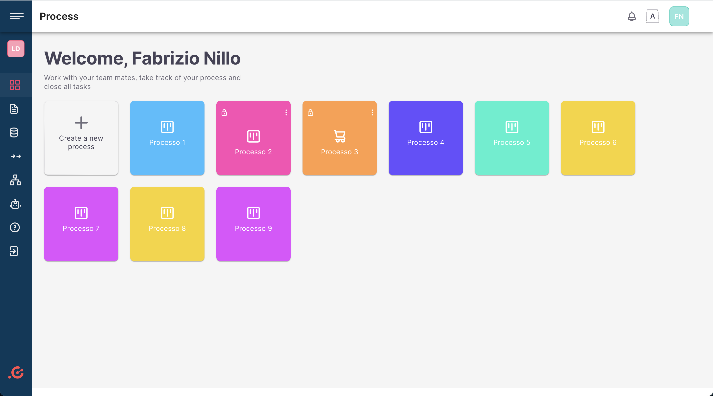

# Coral Process Management Dashboard

## Description

Coral is a frontend dashboard for managing tasks, issues, processes, and more. It is built with React, TypeScript Material UI, and some backend services.

## This project is bootstrapped with React create app

</br>

[](https://github.com/Everduin94/better-commits)


## Demo

[Live Demo](coming soon)
</br>



</br>


## Built With

- **ReactJS** - JavaScript Frontend Library
- **TypeScript** - Static Typing
- **Material UI** - UI Library
- **Reqres API** - For autentication
- **Mockend API** - For Mocking backend data & API endpoints
- **React Router** - For routing
- **Formik & Yup** - For form validation

## Getting Started

### Prerequisites

- [Node.js](https://nodejs.org/en/) - Node.js® is a JavaScript runtime built on Chrome's V8 JavaScript engine.
- [npm](https://www.npmjs.com/) - npm is the package manager for JavaScript and the world’s largest software registry.

### Installing

1. Clone the repo

```bash
git clone https://github.com/olaishola05/coral.git
```

2. Install dependencies

```bash
npm install
```

env file

```bash
REACT_APP_BASE_URL= https://reqres.in/api
```

4. Run the development server

```bash
npm start
```

5. Open [http://localhost:3000](http://localhost:3000) with your browser to see the result.

## Author

- GitHub: [@olaishola05](https://github.com/@olaishola05)
- Twitter: [@olaishola05](https://twitter.com/@olaishola05)
- LinkedIn: [Oladipupo Ishola](https://www.linkedin.com/in/ola-ishola/)
- Medium: [@olaishola](https://medium.com/@olaishola)

## 🤝 Contributing

Contributions, issues and feature requests are welcome!

Feel free to check the [issues page](https://github.com/olaishola05/coral/issues) here 😏😏.

### Show your support

- Give a ⭐ if you like this project

## Acknowledgments

- Thanks to everyone building tools to make developers lives easier
- Also to people at Lasting Dynamics for the figma design and tutoring

## License

This project is licensed under the MIT License - see the [LICENSE.md](MIT.md) file for details
